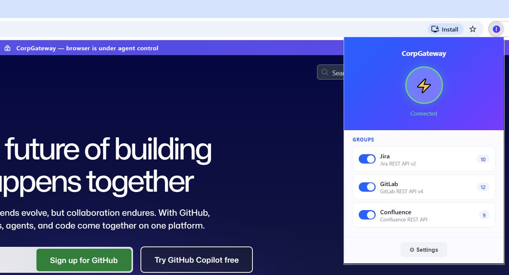
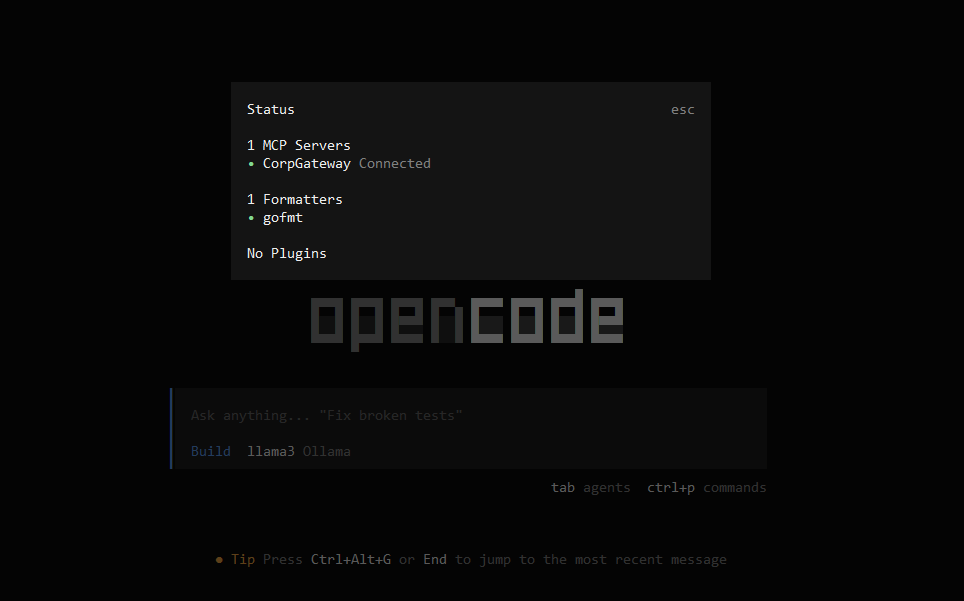
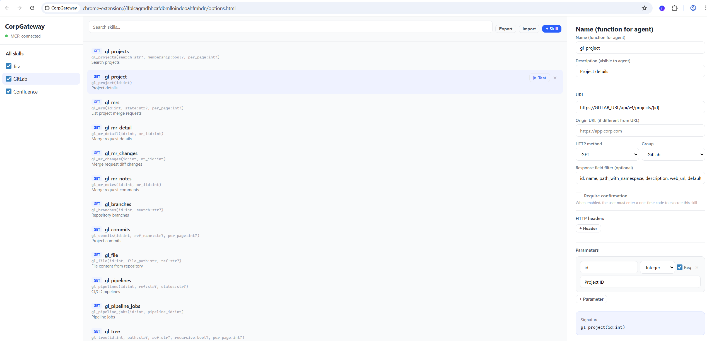

# CorpGateway Extension + MCP Server

[English version](../README.md)

Chrome-расширение + MCP-сервер для подключения AI-агентов к корпоративным системам через браузерную сессию.

> **[Руководство по установке](SETUP.ru.md)** | **[Создание скилов](SKILLS.ru.md)** | **[Безопасность](SECURITY.ru.md)**



## Как это работает

```
┌──────────────────────────────────────────────────────────────┐
│                                                              │
│  AI Agent (OpenCode, Cursor, Claude Code)                    │
│       │                                                      │
│       │ POST /mcp (Bearer token)                             │
│       ▼                                                      │
│  ┌──────────┐    WebSocket     ┌───────────────────────┐     │
│  │ cgw_mcp  │◄────────────────►│  Chrome Extension     │     │
│  │ :9877    │                  │                       │     │
│  │          │                  │  • chrome.cookies     │     │
│  │ Токены:  │                  │  • chrome.webRequest  │     │
│  │ • agent  │                  │  • fetch() с сессией  │     │
│  │ • ext    │                  │  • Настройка скилов   │     │
│  └──────────┘                  └───────────┬───────────┘     │
│                                            │                 │
│                                            │ fetch() + cookies/auth
│                                            ▼                 │
│                                   Corporate APIs             │
│                                   (Jira, Mattermost, ...)    │
└──────────────────────────────────────────────────────────────┘
```

**Ключевое преимущество:** расширение использует существующую сессию браузера для авторизации. Не нужно хранить пароли, API-ключи или настраивать OAuth — если вы залогинены в корпоративной системе в Chrome, расширение автоматически использует эту сессию.

## Компоненты

| Компонент | Описание | Расположение |
|-----------|----------|-------------|
| **Chrome Extension** | Управление скилами, выполнение запросов через браузерную сессию | `extension/` |
| **cgw_mcp** | MCP-сервер (HTTP + WebSocket daemon), мост между агентом и расширением | `cgw_mcp/` |
| **Presets** | Готовые наборы скилов для популярных систем | `presets/` |

## Быстрый старт

### 1. Установить расширение

1. Откройте `chrome://extensions`
2. Включите **Developer mode**
3. Нажмите **Load unpacked** → выберите папку `extension/`

### 2. Установить и запустить cgw_mcp

```bash
cd cgw_mcp
npm install
```

**Как демон (автозапуск):**

```bash
# Linux / macOS
./install.sh

# Windows (PowerShell)
.\install.ps1
```

**Вручную:**

```bash
node index.js
```

При первом запуске создаётся конфиг `~/.corpgateway/cgw_mcp.json`:

```json
{
  "port": 9877,
  "token": "abc123...",
  "extensionToken": "def456...",
  "mcpInstructions": "..."
}
```

### 3. Подключить расширение к cgw_mcp

1. Иконка расширения → **⚙ Настройки**
2. В разделе **Подключение к MCP**:
   - **Имя экземпляра:** любое (напр. «Chrome Рабочий»)
   - **URL сервера MCP:** `http://localhost:9877`
   - **Токен расширения:** скопируйте `extensionToken` из `~/.corpgateway/cgw_mcp.json`
3. Нажмите **Сохранить**
4. В popup расширения нажмите **⚡ Подключить**
5. Иконка расширения станет цветной — соединение установлено

### 4. Импортировать скилы

1. Настройки расширения → **Импорт**
2. Выберите файл из `presets/` (напр. `jira.json`)
3. Замените URL-заглушки на реальные адреса ваших систем

### 5. Подключить AI-агента



Добавьте в конфиг агента (`opencode.json`, `.cursor/mcp.json` и т.д.):

```json
{
  "mcp": {
    "corp": {
      "type": "remote",
      "url": "http://localhost:9877/mcp",
      "headers": {
        "Authorization": "Bearer <token из cgw_mcp.json>"
      }
    }
  }
}
```

## MCP Tools

Агент получает 5 мета-инструментов:

| Tool | Описание | Параметры |
|------|----------|-----------|
| `cgw_groups` | Список доступных групп | — |
| `cgw_list` | Список скилов (все или по группе) | `group?` |
| `cgw_schema` | Параметры скила (включая флаг `confirm`) | `skill` |
| `cgw_invoke` | Вызов скила (`confirm=false`) | `skill`, `params?` |
| `cgw_invoke_confirmed` | Вызов скила с подтверждением (`confirm=true`) | `skill`, `params?` |

### Workflow агента

```
1. cgw_groups              → видит группы (Jira, Mattermost, ...)
2. cgw_list(group=jira)    → видит скилы группы
3. cgw_schema(skill=jira_issue) → видит параметры + флаг confirm + какой invoke использовать
4. cgw_invoke(skill=jira_issue, params={key:"PROJ-1"}) → результат (confirm=false)
   cgw_invoke_confirmed(skill=delete_issue, params={key:"PROJ-1"}) → результат (confirm=true)
```

## Настройка скилов

> **Подробное руководство:** [Создание кастомных скилов](SKILLS.ru.md) ([English](../SKILLS.md))



### Через UI расширения

Настройки расширения (`chrome://extensions` → CorpGateway → Details → Extension options):

- **Sidebar:** группы с переключением активности
- **Центр:** список скилов с поиском, бейджами методов
- **Правая панель:** редактирование скила, тест, настройки

### Структура скила

| Поле | Описание |
|------|----------|
| Название | Имя функции для агента (напр. `jira_issue`) |
| Описание | Что делает скил (видно агенту) |
| URL | Адрес API с path-параметрами `{id}` |
| HTTP метод | GET, POST, PUT, PATCH, DELETE |
| Origin URL | Откуда выполнять запрос (если отличается от URL) |
| Body Template | JSON-шаблон тела с `{{param}}` плейсхолдерами |
| Response Filter | Dot-notation пути для фильтрации ответа |
| HTTP заголовки | Кастомные заголовки (поддерживают `{{param}}`) |
| Параметры | Имя, тип (String/Integer/Float/Boolean/Date), обязательность, описание |

### Подстановка параметров

| Место | Формат | Пример |
|-------|--------|--------|
| URL path | `{param}` | `/api/issues/{key}` → `/api/issues/PROJ-1` |
| Body | `{{param}}` | `{"text":"{{msg}}"}` → `{"text":"Hello"}` |
| Headers | `{{param}}` | `X-Data: {{token}}` → `X-Data: abc123` |
| Query string | автоматически | GET + remaining params → `?q=test&limit=10` |

### Группы

Скилы организованы в группы. Каждая группа может быть включена/выключена — отключённые группы и их скилы не видны агенту.

Описание группы используется как заголовок в `cgw_list`:

```
# Available skills

## Jira — управление задачами
jira_issue(key:str)  // Детали задачи
jira_search(jql:str)  // Поиск по JQL

## Mattermost — корпоративный мессенджер
mm_channel_posts(channel_id:str)  // Сообщения канала
```

### Пресеты

Готовые наборы скилов в `presets/`:

| Файл | Система | Скилы |
|------|---------|-------|
| `jira.json` | Jira REST API | issue, search, comments, transitions |
| `confluence.json` | Confluence REST API | pages, search, spaces |
| `gitlab.json` | GitLab API | projects, issues, merge requests |
| `mattermost.json` | Mattermost API | channels, posts, users, search |
| `outlook.json` | Microsoft Graph API | mail, calendar, contacts |

После импорта замените URL-заглушки (`JIRA_URL`, `MATTERMOST_URL` и т.д.) на реальные адреса.

## Авторизация

### Как расширение получает доступ к API

1. **Cookies:** `chrome.cookies` API — расширение имеет доступ к cookies всех разрешённых доменов
2. **Authorization headers:** `chrome.webRequest.onSendHeaders` — перехватывает Authorization из всех запросов браузера (Bearer токены, JWT)
3. **Fetch с credentials:** запросы выполняются из Service Worker расширения с `credentials: 'include'`

**Вам не нужно вводить пароли или API-ключи.** Если вы залогинены в корпоративной системе в Chrome — расширение автоматически использует эту сессию.

### Безопасность

```
┌─────────────────────────────────────────────────────────┐
│  Уровень 1: HTTP API (cgw_mcp)                         │
│  • Bearer token на каждый запрос от агента              │
│  • Timing-safe сравнение токенов                        │
│  • Rate limiting: 10 попыток/мин по IP                  │
│  • localhost only — не доступен из сети                 │
│  • CORS ограничен localhost                             │
│  • Whitelist JSON-RPC методов                           │
│  • Лимит размера сообщений (1 МБ)                      │
│                                                         │
│  Уровень 2: WebSocket (cgw_mcp ↔ расширение)           │
│  • Extension token для аутентификации                   │
│  • Mutual auth: HMAC challenge-response                 │
│  • Обе стороны доказывают знание extensionToken         │
│                                                         │
│  Уровень 3: Chrome Extension                            │
│  • Sender validation — web-страницы не могут слать      │
│    команды расширению                                   │
│  • SSRF-защита: блокировка приватных IP, только http(s) │
│  • Валидация шаблонов: защита от injection в JSON/HTTP  │
│  • Подключение к MCP — только по кнопке пользователя   │
│  • Уведомления при истечении сессии авторизации         │
│                                                         │
│  Уровень 4: Данные                                      │
│  • Credentials не хранятся — используется сессия Chrome │
│  • Токены в cgw_mcp.json с правами 0600                │
│  • Скилы в chrome.storage.local (зашифровано Chrome)    │
│  • Audit log: последние 100 вызовов в session storage   │
│  • Токены маскируются в логах                           │
│  • Двойное подтверждение: cgw_invoke_confirmed + OTP    │
└─────────────────────────────────────────────────────────┘
```

## Конфигурация

### cgw_mcp.json

Расположение: `~/.corpgateway/cgw_mcp.json`

```json
{
  "port": 9877,
  "token": "agent-token",
  "extensionToken": "extension-ws-token",
  "mcpInstructions": "Инструкция для агента..."
}
```

| Поле | Описание |
|------|----------|
| `port` | HTTP порт cgw_mcp (по умолчанию 9877) |
| `token` | Bearer токен для агента |
| `extensionToken` | Токен для WebSocket-подключения расширения |
| `mcpInstructions` | Текст инструкции, передаваемый агенту при MCP initialize |

### Расширение (Settings)

| Поле | Описание |
|------|----------|
| Имя экземпляра | Идентификация при нескольких браузерах |
| URL сервера MCP | HTTP-адрес cgw_mcp |
| Токен расширения | `extensionToken` из cgw_mcp.json |

## Управление cgw_mcp

### Установка как демон

**Windows:**
```powershell
cd cgw_mcp
.\install.ps1              # установить (Task Scheduler)
.\install.ps1 -Uninstall   # удалить
```

**Linux:**
```bash
cd cgw_mcp
./install.sh               # установить (systemd user service)
./install.sh uninstall      # удалить

systemctl --user status cgw-mcp
systemctl --user restart cgw-mcp
journalctl --user -u cgw-mcp -f
```

**macOS:**
```bash
cd cgw_mcp
./install.sh               # установить (LaunchAgent)
./install.sh uninstall      # удалить

launchctl list | grep cgw-mcp
tail -f ~/.corpgateway/logs/cgw_mcp_launchd.log
```

### Логи

Расположение: `~/.corpgateway/logs/`

```
cgw_mcp_2026-04-01.log
cgw_mcp_2026-03-31.log
...
```

Ротация: хранятся последние 7 дней. Формат:

```
[2026-04-01T10:30:15.123Z] INFO cgw_mcp started on http://localhost:9877
[2026-04-01T10:30:20.456Z] INFO Extension connected: "Chrome Рабочий"
[2026-04-01T10:31:05.789Z] INFO → Agent request id=1 method=tools/call
[2026-04-01T10:31:06.012Z] INFO → Forwarded to extension id=1
[2026-04-01T10:31:06.234Z] INFO ← Extension response id=1
```

## API Reference

### POST /mcp

MCP JSON-RPC endpoint (Streamable HTTP). Требует `Authorization: Bearer <token>`.

### GET /mcp

SSE keep-alive (MCP spec). Требует `Authorization: Bearer <token>`.

### GET /health

```json
{
  "status": "ok",
  "extension": true,
  "extensionName": "Chrome Рабочий"
}
```

### WS /extension/ws

WebSocket для расширения. Двухэтапная аутентификация:

1. Подключение с `?token=<extensionToken>&name=<instanceName>`
2. Mutual auth (HMAC challenge-response) — обе стороны доказывают знание `extensionToken`

## Несколько браузеров

Если расширение установлено в нескольких профилях Chrome:

1. Каждый профиль имеет свой экземпляр расширения со своими скилами
2. Только один может быть подключён к cgw_mcp одновременно
3. Последний подключившийся вытесняет предыдущего
4. В `GET /health` видно имя подключённого экземпляра
5. Задайте разные **Имена экземпляров** в настройках для идентификации

## Структура файлов

```
├── extension/                  # Chrome Extension (Manifest V3)
│   ├── manifest.json           # Permissions, service worker
│   ├── background.js           # WS-подключение к cgw_mcp, auth capture
│   ├── popup.html/js           # Кнопка подключения, группы
│   ├── options.html/js         # Полная настройка скилов (3-column UI)
│   ├── lib/
│   │   ├── storage.js          # CRUD skills/groups в chrome.storage
│   │   ├── executor.js         # Выполнение скилов (fetch + подстановка)
│   │   └── mcp.js              # MCP JSON-RPC handler (5 meta-tools)
│   └── icons/                  # Цветные + серые иконки
│
├── cgw_mcp/                    # MCP Server (Node.js)
│   ├── index.js                # HTTP + WebSocket сервер
│   ├── package.json
│   ├── install.sh              # Установка демона (Linux/macOS)
│   └── install.ps1             # Установка демона (Windows)
│
├── presets/                    # Готовые наборы скилов
│   ├── jira.json
│   ├── confluence.json
│   ├── gitlab.json
│   ├── mattermost.json
│   └── outlook.json
│
├── README.md
└── SETUP.md                    # Руководство по установке
```
